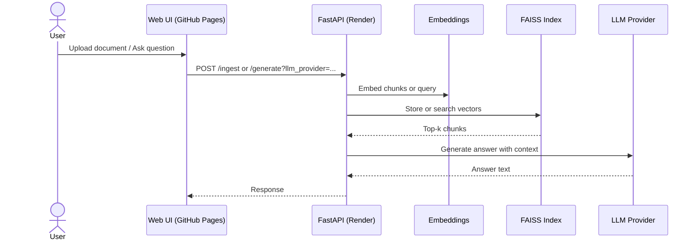

# RAG-Serve - Retrieval Augmented Generation API

RAG-Serve is a production-oriented, containerized RAG (Retrieval-Augmented Generation) system that demonstrates end-to-end AI application engineering. It ingests documents, builds a FAISS index, retrieves relevant context, and generates grounded answers using configurable LLM providers.

This repository is a showcase of:

* Backend and API engineering with FastAPI
* RAG pipeline design and retrieval evaluation basics
* Vector search with FAISS
* Multi-provider LLM integration (OpenAI, Gemini)
* CI/CD and Docker-based workflows
* Practical, testable system design

---

## Live Deployment

* Backend API deployed on Render
* Frontend UI hosted on GitHub Pages https://vishalkoriyalearning.github.io/rag-serve/

---

## Features

* Document ingestion (`/ingest`, `/index-doc`)
* PDF and TXT extraction
* Chunking with overlap for retrieval quality
* Embeddings using `sentence-transformers`
* FAISS vector store for fast similarity search
* Semantic search API (`/query`)
* Answer generation API (`/generate`) with provider routing
* Minimal UI for document upload and chat-style Q&A
* GitHub Actions CI (lint, tests, Docker build)

---

## Architecture Overview

1. Ingest a document and extract text
2. Chunk and embed text
3. Build and persist FAISS index and chunks
4. For a query, retrieve top-k relevant chunks
5. Build a context-aware prompt
6. Generate an answer with the selected LLM provider

---

## Sequence Diagram (Mermaid)



---

## Tech Stack

* FastAPI
* FAISS
* Sentence-Transformers
* OpenAI and Gemini LLMs
* Docker and Docker Compose
* GitHub Actions CI
* PyTest and Ruff

---

## Project Structure

```
rag-serve/
├─ app/
│  ├─ core/         # chunker, embeddings, vectorstore, generator
│  ├─ utils/        # pdf text extraction
│  └─ main.py       # FastAPI entrypoint
├─ client/          # static UI
├─ configs/         # model configs
├─ storage/         # FAISS index and metadata
├─ tests/           # pytest unit tests
├─ docker-compose.yml
├─ Dockerfile
└─ README.md
```

---

## Getting Started (Local)

1. Create virtual environment

```bash
python -m venv .venv
source .venv/bin/activate  # Windows: .venv\Scripts\activate
```

2. Install dependencies

```bash
pip install -r requirements.txt
```

3. Configure environment

```bash
copy .env.example .env   # Windows
# cp .env.example .env   # macOS/Linux
```

4. Run FastAPI

```bash
uvicorn app.main:app --reload
```

Visit http://localhost:8000/docs

---

## Configuration

Set your API keys in `.env` or provide them at runtime:

* `OPENAI_API_KEY`, `OPENAI_MODEL`
* `GEMINI_API_KEY`, `GEMINI_MODEL`
* `EMBEDDING_MODEL`, `TOP_K`

The UI sends the provider as `llm_provider` with values:

* `openai`
* `gemini`

---

## API Endpoints

* `GET /health` - health check
* `GET /metrics` - Prometheus metrics
* `POST /ingest` - upload a document
* `POST /index-doc` - build the FAISS index
* `POST /query` - semantic search
* `POST /generate` - RAG + LLM answer

Example request:

```bash
curl -X POST "http://localhost:8000/generate?llm_provider=openai" \
  -H "Content-Type: application/json" \
  -H "X-API-Key: <your_key>" \
  -d "{\"query\":\"What is this document about?\",\"top_k\":3}"
```

---

## Frontend UI

The UI is a static client in `client/`:

* Select LLM provider (OpenAI or Gemini)
* Enter API key (stored locally in the browser)
* Upload documents and ask questions

The UI points to the deployed backend by default and can be adjusted in `client/script.js`.

---

## Testing

```bash
pytest -q
ruff check .
```

---

## CI/CD

GitHub Actions runs:

* Ruff linting
* PyTest unit tests
* Docker build checks

---

## Roadmap Ideas

* Reranking or hybrid retrieval
* Multi-document chat memory
* API auth and rate limiting
* Usage analytics dashboard
* Experiment tracking

