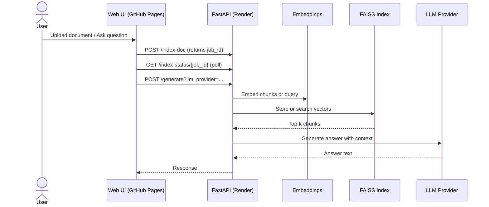

# RAG-Serve - Retrieval Augmented Generation API

RAG-Serve is a production-oriented, containerized RAG (Retrieval-Augmented Generation) system that demonstrates end-to-end AI application engineering. It ingests documents, builds a FAISS index, retrieves relevant context, and generates grounded answers using configurable LLM providers.

This repository is a showcase of:

* Backend and API engineering with FastAPI
* RAG pipeline design and retrieval evaluation basics
* Vector search with FAISS
* Multi-provider LLM integration (OpenAI, Gemini, Ollama)
* CI/CD and Docker-based workflows
* Practical, testable system design

---

## Live Deployment

* Backend API deployed on Render
* API docs: https://rag-serve.onrender.com/docs
* Frontend UI (GitHub Pages): https://vishalkoriyalearning.github.io/rag-serve/

Note: Render free tier instances can spin down on inactivity; the first request after inactivity may take ~50 seconds to respond.

To try the deployed demo end-to-end, you can use your own LLM API key for answer generation:

1. Open the UI link above
2. Select `OpenAI` or `Google Gemini`
3. Paste your API key (stored only in your browser)
4. Upload a document and ask questions

---

## Features

* Document ingestion (`/ingest`, `/index-doc`)
* PDF and TXT extraction
* Chunking with overlap for retrieval quality
* Embeddings
  * `PLATFORM=LOCAL`: `sentence-transformers` (local, no external API calls for retrieval)
  * `PLATFORM=CLOUD`: OpenAI embeddings API (lightweight for small cloud instances)
* FAISS vector store for fast similarity search
* Async/background indexing jobs with status polling (`/index-status/{job_id}`) to avoid request timeouts in production hosts
* Semantic search API (`/query`)
* Answer generation API (`/generate`) with provider routing
* Minimal UI for document upload and chat-style Q&A
* GitHub Actions CI (lint, tests, Docker build)

---

## Architecture Overview

1. Ingest a document and extract text
2. Chunk and embed text
3. Build and persist FAISS index and chunks (runs as a background job; poll for completion)
4. For a query, retrieve top-k relevant chunks
5. Build a context-aware prompt
6. Generate an answer with the selected LLM provider

---

## Sequence Diagram (Mermaid)



---

## Tech Stack

* FastAPI
* FAISS
* Sentence-Transformers (LOCAL embeddings)
* OpenAI embeddings (CLOUD retrieval)
* OpenAI + Gemini (hosted LLMs) and Ollama (local LLM runtime)
* Docker and Docker Compose
* GitHub Actions CI
* PyTest and Ruff

---

## Project Structure

```
rag-serve/
├─ app/
│  ├─ core/         # chunker, embeddings, vectorstore, generator
│  ├─ utils/        # pdf text extraction
│  └─ main.py       # FastAPI entrypoint
├─ client/          # static UI
├─ configs/         # model configs
├─ storage/         # FAISS index and metadata
├─ tests/           # pytest unit tests
├─ docker-compose.yml
├─ Dockerfile
└─ README.md
```

---

## Run Locally (Recommended)

This is the best way for reviewers to test the full system without any paid API keys:

* `PLATFORM=LOCAL` for local embeddings via `sentence-transformers`
* `llm_provider=ollama` for local answer generation via Ollama

### Option A: Docker Compose (API + Ollama)

Docker build installs CPU-only PyTorch wheels to avoid large CUDA downloads.

1. Copy env file and set local mode

```bash
copy .env.example .env   # Windows
# cp .env.example .env   # macOS/Linux
```

In `.env`, set:

* `PLATFORM=LOCAL`

2. Start services

```bash
docker-compose up --build
```

3. Pull an Ollama model (once)

```bash
docker exec -it ollama ollama pull llama3.2:1b
```

4. Open docs and test

* Swagger UI: http://localhost:8000/docs
* UI: open https://vishalkoriyalearning.github.io/rag-serve/?api=http://127.0.0.1:8000
  * Choose `Ollama (Local)` as provider (no API key needed)

### Option B: Python venv + Ollama (No Docker)

1. Create virtual environment

```bash
python -m venv .venv
source .venv/bin/activate  # Windows: .venv\Scripts\activate
```

2. Install dependencies

```bash
pip install -r requirements.txt
```

3. Configure environment

```bash
copy .env.example .env   # Windows
# cp .env.example .env   # macOS/Linux
```

4. Run FastAPI

```bash
uvicorn app.main:app --reload
```

Visit http://localhost:8000/docs

To use Ollama locally, install Ollama and set:

* `OLLAMA_HOST=http://localhost:11434`
* `OLLAMA_MODEL=llama3.2:1b`

---

## Configuration

Set your API keys in `.env` or provide them at runtime:

* `OPENAI_API_KEY`, `OPENAI_MODEL`
* `GEMINI_API_KEY`, `GEMINI_MODEL`
* `EMBEDDING_MODEL` (CLOUD), `LOCAL_EMBEDDING_MODEL` (LOCAL), `TOP_K`

The UI sends the provider as `llm_provider` with values:

* `openai`
* `gemini`
* `ollama` (local backend only)

### Cloud vs Local Embeddings

* `PLATFORM=LOCAL` uses `sentence-transformers` for local embeddings (developer-friendly, no external API calls for retrieval).
* `PLATFORM=CLOUD` uses OpenAI embeddings to keep cloud deployments lightweight and more stable on small instances (requires `OPENAI_API_KEY` on the backend).

If you switch embedding mode or models, delete `app/storage/faiss.index` and `app/storage/chunks.json` and re-index your documents.

---

## API Endpoints

* `GET /health` - health check
* `GET /metrics` - Prometheus metrics
* `POST /ingest` - upload a document
* `POST /index-doc` - start building the FAISS index (async; returns `202` + `job_id`)
* `GET /index-status/{job_id}` - check indexing job status
* `POST /query` - semantic search
* `POST /generate` - RAG + LLM answer

Example request:

```bash
curl -X POST "http://localhost:8000/generate?llm_provider=openai" \
  -H "Content-Type: application/json" \
  -H "X-API-Key: <your_key>" \
  -d "{\"query\":\"What is this document about?\",\"top_k\":3}"
```

Local Ollama example (no API key):

```bash
curl -X POST "http://localhost:8000/generate?llm_provider=ollama" \
  -H "Content-Type: application/json" \
  -d "{\"query\":\"What is this document about?\",\"top_k\":3}"
```

Indexing example (async):

```bash
# Start indexing (returns 202 with job_id)
curl -X POST "http://localhost:8000/index-doc" \
  -H "accept: application/json" \
  -H "Content-Type: multipart/form-data" \
  -F "file=@your.pdf;type=application/pdf"

# Poll job status
curl "http://localhost:8000/index-status/<job_id>"
```

---

## Frontend UI

The UI is a static client in `client/`:

* Select LLM provider (OpenAI, Gemini, or Ollama when pointing to a local backend)
* Enter API key (stored locally in the browser)
* Upload documents and ask questions

The UI points to the deployed backend by default and can be adjusted in `client/script.js`.

Tip: You can point the GitHub Pages UI to a local backend without changing code:

* https://vishalkoriyalearning.github.io/rag-serve/?api=http://127.0.0.1:8000

---

## Deployment Notes (Render + GitHub Pages)

This repo is set up to deploy a lightweight backend container on Render and a static UI on GitHub Pages.

Backend (Render):

* Runs `PLATFORM=CLOUD` to use OpenAI embeddings and avoid heavyweight local ML dependencies on small instances.
* Uses background indexing (`202` + job polling) to prevent long-running PDF indexing from timing out.
* CORS is configured to allow requests from the GitHub Pages origin.

Docker image sizing:

* `requirements-cloud.txt` is used for cloud builds (lean runtime deps)
* `requirements.txt` is used for local builds (includes `sentence-transformers` / `torch` for LOCAL embeddings)

---

## Testing

```bash
pytest -q
ruff check .
```

---

## CI/CD

GitHub Actions runs:

* Ruff linting
* PyTest unit tests
* Docker build checks

---

## Roadmap Ideas

* Reranking or hybrid retrieval
* Multi-document chat memory
* API auth and rate limiting
* Usage analytics dashboard
* Experiment tracking
